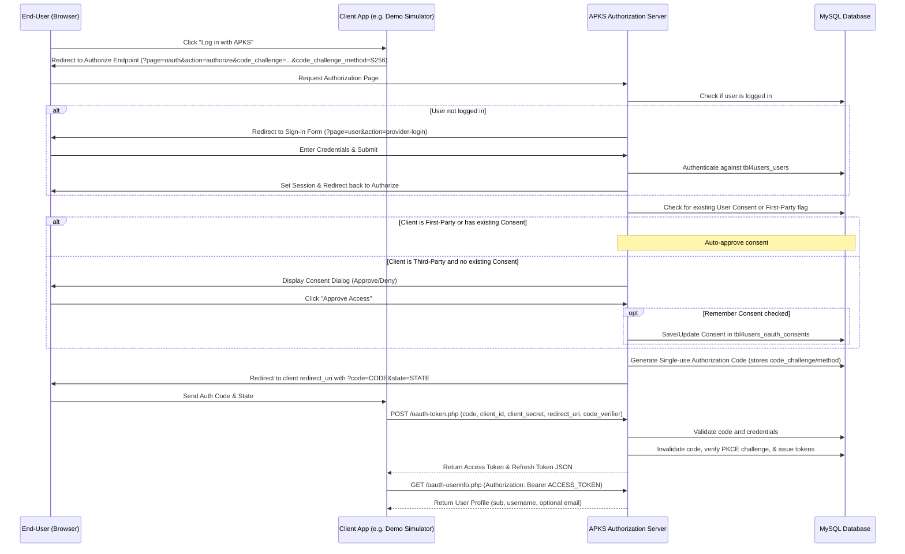

# APKS OAuth2 Identity Provider (IdP) Documentation

This document describes the design, database architecture, and integration flows of the custom-built **OAuth2 Identity Provider (IdP)** in the APKS platform. It operates as the central authentication authority (Single Sign-On or SSO) for both first-party dashboard services and external third-party client integrations.

---

## 🏗️ System Architecture

The Identity Provider implements the standard **OAuth2 Authorization Code Grant** flow with support for **Proof Key for Code Exchange (PKCE)** to secure authorization code exchanges on public and web clients.



---

## 🗄️ Database Schema

The system uses a **No-Foreign-Key (MyISAM-compatible) relational schema** hosted on the `db4apks_webapp` MySQL database. Referential integrity is strictly maintained by application-layer transactions.

### 1. User Records (`tbl4users_users`)
Stores hashed authentication accounts and profile metadata.

| Column Name | Type | Description |
| :--- | :--- | :--- |
| `id` | INT | Primary Key, Auto-increment |
| `uuid` | CHAR(36) | Immutable unique identifier. Used as the OIDC `sub` claim. |
| `username` | VARCHAR(50) | Unique username used for logins. |
| `password_hash` | VARCHAR(255) | Password hashed using bcrypt (`PASSWORD_DEFAULT`). |
| `application` | VARCHAR(100) | Application context associated with the user. |
| `email_verified` | TINYINT(1) | Status of email verification (`0` = unverified, `1` = verified). Default: `0`. |
| `status` | VARCHAR(50) | Account state (e.g., `active`, `suspended`, `banned`). Default: `'active'`. |
| `failed_login_attempts` | INT | Counter for failed logins. Resets to `0` on successful authentication. |
| `created_at` | TIMESTAMP | Record creation date. Default: `CURRENT_TIMESTAMP`. |

### 2. Registered Clients (`tbl4users_oauth_clients`)
Defines application client configurations permitted to request access tokens.

| Column Name | Type | Description |
| :--- | :--- | :--- |
| `client_id` | VARCHAR(80) | Primary Key. The unique public identifier of the client. |
| `client_secret` | VARCHAR(80) | Secure secret key for client authentication. |
| `name` | VARCHAR(100) | Human-readable name of the application. |
| `redirect_uri` | VARCHAR(2000) | Default authorized callback URI. |
| `allowed_redirect_uris` | JSON | Strict JSON list of authorized callback URLs for security validation checks. |
| `allowed_grant_types` | JSON | JSON list of permitted authorization flows (e.g., `["authorization_code", "refresh_token"]`). |
| `allowed_scopes` | JSON | JSON list of scopes this client is allowed to request (e.g., `["profile", "email"]`). |
| `scope` | VARCHAR(255) | Default scope for this client. Default: `'profile'`. |
| `first_party` | TINYINT(1) | Flags first-party apps (`1` = bypasses the user consent screen, `0` = show consent). |
| `created_at` | TIMESTAMP | Client creation date. Default: `CURRENT_TIMESTAMP`. |

### 3. Short-lived Codes (`tbl4users_oauth_codes`)
Stores single-use authorization codes with a lifetime of 5 minutes.

| Column Name | Type | Description |
| :--- | :--- | :--- |
| `code` | VARCHAR(80) | Primary Key. The authorization code string. |
| `client_id` | VARCHAR(80) | ID of the client that requested the code. Indexed. |
| `redirect_uri` | VARCHAR(2000) | Redirect URI matching the original authorization request. |
| `username` | VARCHAR(50) | The username of the user granting the authorization. |
| `scope` | VARCHAR(255) | The space-separated list of scopes authorized by the user. |
| `state` | VARCHAR(255) | The state token passed in the authorize request for CSRF protection. |
| `code_challenge` | VARCHAR(255) | The PKCE code challenge. |
| `code_challenge_method` | VARCHAR(50) | The PKCE code challenge method (e.g., `S256`). |
| `expires_at` | INT UNSIGNED | Unix timestamp when the code expires. Indexed. |
| `created_at` | TIMESTAMP | Record creation date. Default: `CURRENT_TIMESTAMP`. |

### 4. Sessions & Tokens (`tbl4users_oauth_tokens`)
Stores active access tokens and associated long-lived refresh tokens.

| Column Name | Type | Description |
| :--- | :--- | :--- |
| `access_token` | VARCHAR(120) | Primary Key. The active bearer token string. |
| `client_id` | VARCHAR(80) | ID of the client that owns the token. Indexed. |
| `username` | VARCHAR(50) | The username of the resource owner. Indexed. |
| `scope` | VARCHAR(255) | Scopes granted to the bearer token. |
| `refresh_token` | VARCHAR(120) | Long-lived refresh token used to request new access tokens silently. |
| `refresh_token_expires_at` | INT UNSIGNED | Unix timestamp when the refresh token expires. |
| `is_revoked` | TINYINT(1) | Revocation status (`1` = revoked, `0` = active). Used for RFC 7009 revocation. |
| `expires_at` | INT UNSIGNED | Unix timestamp when the access token expires. Indexed. |
| `created_at` | TIMESTAMP | Record creation date. Default: `CURRENT_TIMESTAMP`. |

### 5. User Consent Tracking (`tbl4users_oauth_consents`)
Records explicit authorizations given by users to client applications to support persistent consent bypass on subsequent logins.

| Column Name | Type | Description |
| :--- | :--- | :--- |
| `id` | INT | Primary Key, Auto-increment. |
| `user_id` | INT | The database ID of the user (`tbl4users_users.id`). Indexed. |
| `client_id` | VARCHAR(80) | The client ID (`tbl4users_oauth_clients.client_id`). Indexed. |
| `scopes_granted` | JSON | JSON list of scopes granted to this client by this user. |
| `granted_at` | TIMESTAMP | Date consent was recorded. Default: `CURRENT_TIMESTAMP`. |

---

## 📡 Core Endpoints

### 1. Authorization Endpoint
Renders the login/consent gate.
- **URL**: `GET /index.php?page=oauth&action=authorize`
- **Parameters**:
  - `client_id` (Required): The client ID of the requesting application.
  - `redirect_uri` (Required): The URL to redirect back to. Must match client configuration.
  - `response_type` (Required): Must be `code`.
  - `scope` (Optional): e.g. `profile` or `profile email`. Default: `profile`.
  - `state` (Recommended): A CSRF token.
  - `code_challenge` (Optional): The challenge string for PKCE verification.
  - `code_challenge_method` (Optional): The PKCE transformation method (e.g., `S256` or `plain`).
- **Behavior**:
  - If the user session is absent, redirects to `provider-login`.
  - If the client is marked as `first_party=1`, or if a record matching the user and client ID exists in `tbl4users_oauth_consents` covering the requested scopes, the authorization server immediately generates a code and redirects.
  - Otherwise, displays a visual consent approval window listing client details, requested scopes, and a checkbox to remember approval.

### 2. Token Exchange Endpoint
Exchanges authorization codes for access and refresh tokens.
- **URL**: `POST /oauth-token.php`
- **Headers**:
  - `Content-Type: application/x-www-form-urlencoded`
- **POST Parameters**:
  - `grant_type` (Required): Must be `authorization_code`.
  - `code` (Required): The authorization code received in the redirect callback.
  - `redirect_uri` (Required): The callback URL.
  - `client_id` (Required): The client ID.
  - `client_secret` (Required): The client secret.
  - `code_verifier` (Optional): The plain-text code verifier matching the original `code_challenge` (for clients utilizing PKCE).
- **Response (200 OK)**:
  ```json
  {
    "access_token": "token_e3fb84a0d922...",
    "token_type": "Bearer",
    "expires_in": 3600,
    "refresh_token": "refresh_b4a8e0f1...",
    "scope": "profile"
  }
  ```

### 3. User Information Endpoint
Provides resource details for validated tokens.
- **URL**: `GET /oauth-userinfo.php`
- **Headers**:
  - `Authorization: Bearer {YOUR_ACCESS_TOKEN}`
- **Response (200 OK)**:
  ```json
  {
    "sub": "admin",
    "username": "admin",
    "scope": "profile"
  }
  ```
- **Response (200 OK with Email Scope)**:
  If the token has authorization for the `email` scope, a mock email address matched to the user is included:
  ```json
  {
    "sub": "admin",
    "username": "admin",
    "scope": "profile email",
    "email": "admin@internal.ecosystem",
    "email_verified": true
  }
  ```

---

## 📡 User Management REST API

The system exposes a secure administrative user management endpoint at `/api-users.php`. This allows registered OAuth application clients to list, read, register, update, or delete system users programmatically.

### 1. Client Credentials Authentication
To call this API, the calling client application must authenticate using its OAuth client credentials (`client_id` and `client_secret` from `tbl4users_oauth_clients`):
- **HTTP Basic Authentication** (Recommended):
  ```text
  Authorization: Basic {Base64(client_id:client_secret)}
  ```
- **Request Parameters / JSON Body**: Include `client_id` and `client_secret` in the URL query parameters, URL-encoded POST body, or JSON payload keys.

### 2. Request Routing
Requests can be routed in two ways:
- **HTTP Method Routing**: The API maps standard REST verbs automatically (`GET` = list/get, `POST` = create, `PUT/PATCH` = update, `DELETE` = delete).
- **Explicit Parameter Routing**: Provide the `action` parameter (`list`, `get`, `create`, `update`, `delete`) in the request body or URL.

---

### 3. API Reference

#### A. List Users
Queries all system users.
- **Method**: `GET`
- **Action Parameter**: `action=list`
- **Query Params**:
  - `q` (Optional): Filter to search usernames containing a matching string.
- **Headers**:
  - `Authorization: Basic {BASE64_CREDENTIALS}`
- **Response (200 OK)**:
  ```json
  {
    "status": "success",
    "users": [
      {
        "id": 1,
        "username": "admin",
        "application": "default_app",
        "created_at": "2026-06-17 04:15:50"
      },
      {
        "id": 2,
        "username": "user",
        "application": "default_app",
        "created_at": "2026-06-17 04:15:50"
      }
    ]
  }
  ```

#### B. Get User Details
Fetches a single user's record.
- **Method**: `GET`
- **Action Parameter**: `action=get`
- **Query Params**:
  - `username` (Required): Username of the account to fetch.
- **Response (200 OK)**:
  ```json
  {
    "status": "success",
    "user": {
      "id": 2,
      "username": "user",
      "created_at": "2026-06-17 04:15:50"
    }
  }
  ```
- **Response (404 Not Found)**:
  ```json
  {
    "error": "not_found",
    "error_description": "User not found."
  }
  ```

#### C. Register User
Creates a new system account.
- **Method**: `POST`
- **Action Parameter**: `action=create`
- **Request Body (JSON or Form URL-Encoded)**:
  ```json
  {
    "username": "new_app_user",
    "password": "secure_password",
    "application": "client_app_name"
  }
  ```
  *Note: `application` is optional and defaults to `"default_app"`.*
- **Response (201 Created)**:
  ```json
  {
    "status": "success",
    "message": "User created successfully."
  }
  ```
- **Response (409 Conflict)**:
  ```json
  {
    "error": "conflict",
    "error_description": "Username already exists."
  }
  ```

#### D. Update User Password
Resets the password for a user account.
- **Method**: `PUT` or `PATCH`
- **Action Parameter**: `action=update`
- **Request Body**:
  ```json
  {
    "username": "new_app_user",
    "password": "new_secure_password"
  }
  ```
- **Response (200 OK)**:
  ```json
  {
    "status": "success",
    "message": "Password updated successfully."
  }
  ```

#### E. Delete User
Deletes the user and revokes associated tokens.
- **Method**: `DELETE`
- **Action Parameter**: `action=delete`
- **Query Params / Request Body**:
  - `username` (Required): Username to delete.
- **Response (200 OK)**:
  ```json
  {
    "status": "success",
    "message": "User deleted successfully."
  }
  ```
  > [!IMPORTANT]
  > Deleting a user cleans up referential constraints in the application layer, automatically removing all associated authorization codes and access tokens linked to that user in `tbl4users_oauth_codes` and `tbl4users_oauth_tokens`.

---

## 🔒 Security Best Practices

1. **Keep Secrets Secret**:
   Never expose the `client_secret` in frontend Javascript. Code-to-token exchanges must be processed securely by the client application's backend server.
2. **State Validation (CSRF Protection)**:
   Always pass a secure, unpredictable random string as the `state` parameter when sending a user to log in. Validate that the returning `state` parameter matches the original token to prevent cross-site request forgery.
3. **Database Cleansing & Housekeeping**:
   Expired codes and tokens remain in the database after use. The application automatically sweeps and drops expired codes inside `OAuthProvider::createAuthCode()` and expired tokens inside `OAuthProvider::createAccessToken()` to prevent table bloat.
4. **HTTPS Enforcement**:
   Ensure all production callback endpoints and token handlers strictly require SSL (HTTPS) to shield plaintext credentials and bearer tokens from wiretapping or interception.
