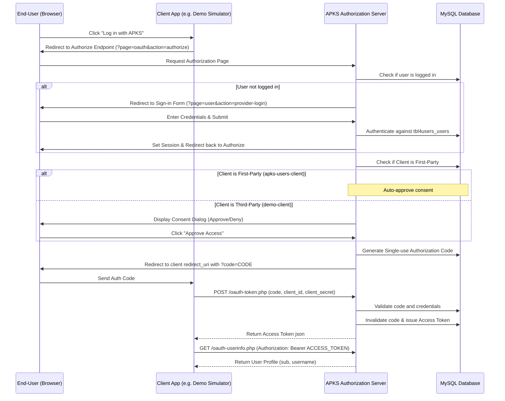

# APKS OAuth2 Identity Provider (IdP) Documentation

This document describes the design, database architecture, and integration flows of the custom-built **OAuth2 Identity Provider (IdP)** in the APKS platform. It operates as the central authentication authority (Single Sign-On or SSO) for both first-party dashboard services and external third-party client integrations.

---

## 🏗️ System Architecture

The Identity Provider implements the standard **OAuth2 Authorization Code Grant** flow. It consists of the following components:



---

## 🗄️ Database Schema

The system uses a **No-Foreign-Key (MyISAM-compatible) relational schema** hosted on the `db4apks_webapp` MySQL database. Referential integrity is strictly maintained by application-layer transactions.

### 1. User Records (`tbl4users_users`)
Stores hashed authentication accounts.
- `id` (int, Primary Key, Auto-increment)
- `username` (varchar(50), Unique)
- `password` (varchar(255))
- `email` (varchar(100), Unique)
- `created_at` (timestamp, Default CURRENT_TIMESTAMP)

### 2. Registered Clients (`tbl4users_oauth_clients`)
Defines applications allowed to request access tokens.
- `client_id` (varchar(80), Primary Key)
- `client_secret` (varchar(80))
- `redirect_uri` (varchar(2000))
- `scope` (varchar(250))
- `name` (varchar(100))
- `first_party` (tinyint(1), Default 0) — If `1`, bypasses user consent prompt.

### 3. Short-lived Codes (`tbl4users_oauth_codes`)
One-time authorization tokens (lifetime: 5 minutes).
- `authorization_code` (varchar(80), Primary Key)
- `client_id` (varchar(80), Indexed)
- `username` (varchar(50))
- `redirect_uri` (varchar(2000))
- `expires_at` (datetime, Indexed)
- `scope` (varchar(250))

### 4. Sessions & Tokens (`tbl4users_oauth_tokens`)
Authenticated API tokens (default lifetime: 1 hour).
- `access_token` (varchar(120), Primary Key)
- `client_id` (varchar(80), Indexed)
- `username` (varchar(50), Indexed)
- `expires_at` (datetime, Indexed)
- `scope` (varchar(250))

---

## 📡 Core Endpoints

### 1. Authorization Endpoint
Renders the login/consent gate.
- **URL**: `GET /index.php?page=oauth&action=authorize`
- **Parameters**:
  - `client_id` (Required): The client ID of the requesting application.
  - `redirect_uri` (Required): The URL to redirect back to. Must match client configuration.
  - `response_type` (Required): Must be `code`.
  - `scope` (Optional): e.g. `profile` or `profile email`.
  - `state` (Recommended): A CSRF token.
- **Behavior**:
  - If the user session is absent, redirects to `provider-login`.
  - If the client is marked as `first_party=1`, it immediately generates an authorization code and redirects.
  - Otherwise, displays a visual consent approval window listing client details and scopes.

### 2. Token Exchange Endpoint
Exchanges authorization codes for API tokens.
- **URL**: `POST /oauth-token.php`
- **Headers**:
  - `Content-Type: application/x-www-form-urlencoded`
- **POST Parameters**:
  - `grant_type` (Required): Must be `authorization_code`.
  - `code` (Required): The authorization code received in the redirect callback.
  - `redirect_uri` (Required): The callback URL.
  - `client_id` (Required): The client ID.
  - `client_secret` (Required): The client secret.
- **Response**:
  ```json
  {
    "access_token": "token_e3fb84a0d922...",
    "token_type": "Bearer",
    "expires_in": 3600,
    "scope": "profile"
  }
  ```

### 3. User Information Endpoint
Provides resource details for validated tokens.
- **URL**: `GET /oauth-userinfo.php`
- **Headers**:
  - `Authorization: Bearer {YOUR_ACCESS_TOKEN}`
- **Response**:
  ```json
  {
    "sub": "admin",
    "username": "admin",
    "scope": "profile"
  }
  ```

---

## 🔒 Security Best Practices

1. **Keep Secrets Secret**:
   Never expose the `client_secret` in frontend Javascript. Code-to-token exchanges must be processed securely by the client application's backend server.
2. **State Validation (CSRF Protection)**:
   Always pass a secure, unpredictable random string as the `state` parameter when sending a user to log in. Validate that the returning `state` parameter matches the original token to prevent cross-site request forgery.
3. **Database Cleansing & Housekeeping**:
   Expired codes and tokens remain in the database after use. The application automatically sweeps and drops expired rows from the database inside `OAuthProvider::init()` during active login queries to prevent table bloat.
4. **HTTPS Enforcement**:
   Ensure all production callback endpoints and token handlers strictly require SSL (HTTPS) to shield plaintext credentials and bearer tokens from wiretapping or interception.
